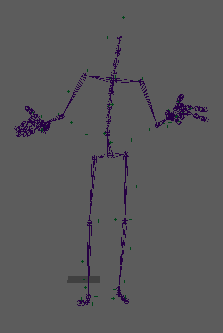

### Trinity Speech Gesture Dataset

<!--  -->

Ylva Ferstl and Rachell McDonnell collected Trinity Speech Gesture [dataset](https://trinityspeechgesture.scss.tcd.ie/) as a part of their [work](https://www.scss.tcd.ie/Rachel.McDonnell/papers/IVA2018b.pdf) on gesture generation.
This dataset may be used for non-commercial purposes only. 

I have cleaned this dataset and converted it from FBX to BVH format.
The resulting gestures are [online](https://kth.box.com/s/eug26hckfiehvygkrsrbwv7rk89hg51a) is the   
The corresponding audio recordings are also [available](https://kth.box.com/s/fb71mmw1u3y8quh266bmaii804jpse8j).

Please cite the following when using this dataset in your research:

Ferstl, Ylva, and Rachel McDonnell. "Investigating the use of recurrent motion modelling for speech gesture generation." Proceedings of the 18th International Conference on Intelligent Virtual Agents. ACM, 2018.

Let me know if you have any questions.
