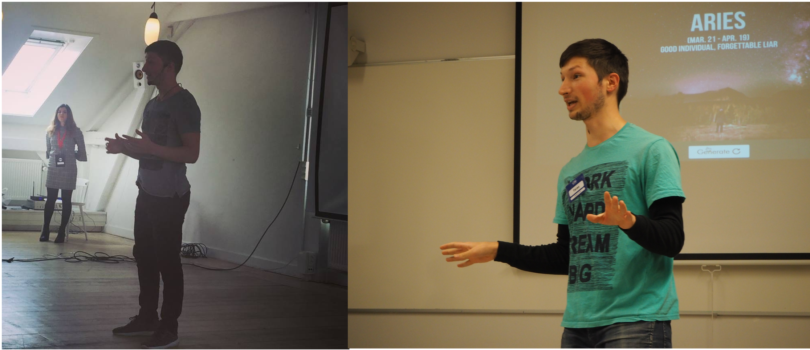

I have been practicing my public speaking skills through worldwide Public Speaking association Toastmasters.
You can see speeches I gave at Loki Toastmasters [here](https://www.youtube.com/watch?v=TzVtUsQEvNY&list=PL87EdZwWToFmeR_EpXVRHfAXTHEvfiEPh).

Below are the talks I gave outside of Toastmasters.

### 2019

* May - talk on my research at [Pint Of Science](http://pintofscience.se/) (20 min)

* Jan. - talk on "Non-verbal behaviour for humanoid robots" at [Stockholm AI](https://stockholm.ai) Study Group #12 (40 min)

### 2018

* Nov. - talk on my research at [Ericsson Consumer and IndustryLab](https://www.ericsson.com/en/trends-and-insights/consumerlab) (30 min)

* May - 3rd place at the evaluation contest of [Toastmasters International](https://toastmasters.org) Division Contest (Scandinavia level)

* Feb. - talk about the possible future enabled by AI at [Unga Ukraine](http://ungaukrainare.se/) for Friday storybar №7 (30 min)

### 2017

* Nov. - talk on "Unsupervised handwriting recognition" at [Stockholm AI](https://stockholm.ai) Study Group #6 (40 min)

