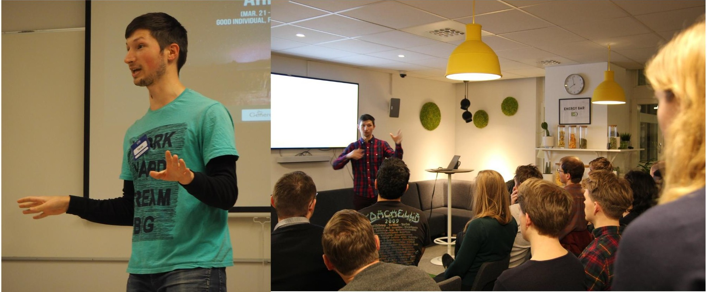

<link href="https://stackpath.bootstrapcdn.com/bootstrap/4.5.2/css/bootstrap.min.css" rel="stylesheet" integrity="sha512-MoRNloxbStBcD8z3M/2BmnT+rg4IsMxPkXaGh2zD6LGNNFE80W3onsAhRcMAMrSoyWL9xD7Ert0men7vR8LUZg==" crossorigin="anonymous">
<link rel="stylesheet" href="https://cdnjs.cloudflare.com/ajax/libs/mdbootstrap/4.19.1/css/mdb.min.css" integrity="sha512-RO38pBRxYH3SoOprtPTD86JFOclM51/XTIdEPh5j8sj4tp8jmQIx26twG52UaLi//hQldfrh7e51WzP9wuP32Q==" crossorigin="anonymous" />
<!-- Fonts & Icons -->
<link rel="stylesheet" href="https://cdnjs.cloudflare.com/ajax/libs/font-awesome/5.14.0/css/all.min.css"  integrity="sha512-1PKOgIY59xJ8Co8+NE6FZ+LOAZKjy+KY8iq0G4B3CyeY6wYHN3yt9PW0XpSriVlkMXe40PTKnXrLnZ9+fkDaog==" crossorigin="anonymous">

I have been practicing my public speaking skills through worldwide Public Speaking association Toastmasters.
You can see speeches I gave at Loki Toastmasters [here](https://www.youtube.com/watch?v=TzVtUsQEvNY&list=PL87EdZwWToFmeR_EpXVRHfAXTHEvfiEPh).

Below are my talks outside of Toastmasters.

### 2020
* <strong>Oct.</strong> - presenting my work on gesture generation for the [Talking Robotics](https://talking-robotics.github.io) seminar series (50 min) \[[Video link](https://youtu.be/JeMwtr8pxcc)\] \[[Talk info](https://talking-robotics.github.io/session_details/taras.html)\]
* <strong>Aug.</strong> - online talk at KPI Summer Science Week Online 2020 (1 h) \[[Video link](https://youtu.be/r8_atMaYj-E)\] 
* <strong>Mar.</strong> - talk at [KAU Data Science School 2020](https://sites.google.com/view/kaudatascienceschool-2020/taras-kucherenko) in Kyiv (1 h) \[[Video link](https://youtu.be/2Ak8uVKgkMM)\]
* <strong>Mar.</strong> - keynote for [the Organization of Young Scientists of KPI](http://ssa.org.ua/) in Kyiv (1 h)

### 2019
* <strong>Sept.</strong> - talk on my research at Max Planck Institute for Intelligent Systems [Perceiving Systems Department](https://ps.is.tuebingen.mpg.de) in Tuebingen (30 min) \[[Talk info](https://ps.is.tuebingen.mpg.de/events/how-to-make-your-agent-gesture-in-a-natural-way)\]

* <strong>July</strong> - presentation of my publication at [IVA 2019](https://iva2019.sciencesconf.org/) (15 min)

*  <strong>May</strong> - talk on my research at [Pint Of Science](http://pintofscience.se/) (20 min)

*  <strong>Jan.</strong> - talk on "Non-verbal behaviour for humanoid robots" at [Stockholm AI](https://stockholm.ai) Study Group #12 (40&nbsp;min)

### 2018

*  <strong>Nov.</strong> - talk on my research at [Ericsson Consumer and IndustryLab](https://www.ericsson.com/en/trends-and-insights/consumerlab) (30 min)

*  <strong>May</strong> - 3rd place at the evaluation contest of [Toastmasters International](https://toastmasters.org) Division Contest (Scandinavia level)

*  <strong>Feb.</strong> - talk about the possible future enabled by AI at [Unga Ukraine](http://ungaukrainare.se/) for Friday storybar №7 (30&nbsp;min)

### 2017

*  <strong>Nov.</strong> - talk on "Unsupervised handwriting recognition" at [Stockholm AI](https://stockholm.ai) Study Group #6 (40 min)

