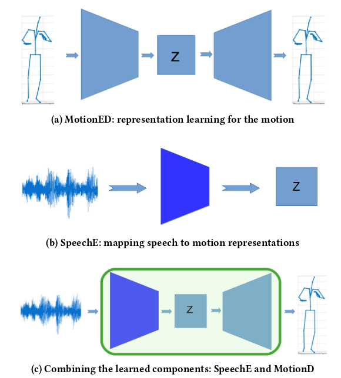

  <b style="font-size: 40px;"> Analyzing input and output representations for speech-driven gesture generation </b>
  
 Taras  Kucherenko,  Dai  Hasegawa, Gustav  Eje  Henter, Naoshi  Kaneko, and Hedvig Kjellström 

  
 International Conference on Intelligent Virtual Agents (IVA '19) 

 <a href="https://www.researchgate.net/publication/331645229_Analyzing_Input_and_Output_Representations_for_Speech-Driven_Gesture_Generation" style="font-size: 38px; text-decoration: none">Paper   </a>  
 <a style="font-size: 38px; text-decoration: none"> |   </a> 
 <a href="https://github.com/GestureGeneration/Speech_driven_gesture_generation_with_autoencoder" style="font-size: 38px; text-decoration: none">   Code</a>   

&nbsp;

&nbsp;

### ABSTRACT
This paper presents a novel framework for automatic speech-driven gesture generation, applicable to human-agent interaction including both virtual agents and robots. Specifically, we extend recent deep-learning-based, data-driven methods for speech-driven gesture generation by incorporating representation learning. Our model takes speech as input and produces gestures as output, in the form of a sequence of 3D coordinates. 

Our approach consists of two steps. First, we learn a lower-dimensional representation of human motion using a denoising autoencoder
neural network, consisting of a motion encoder *MotionE* and a motion decoder *MotionD*. The learned representation preserves the most important aspects of the human pose variation while removing less relevant variation. Second, we train a novel encoder network *SpeechE* to map from speech to a corresponding motion representation with reduced dimensionality. At test time, the speech encoder and the motion decoder networks are combined: *SpeechE* predicts motion representations based on a given speech signal and *MotionD* then decodes these representations to produce motion sequences.

We evaluate different representation sizes in order to find the most effective dimensionality for the representation. We also evaluate the effects of using different speech features as input to the model. We find that mel-frequency cepstral coefficients (MFCCs), alone or combined with prosodic features, perform the best. The results of a subsequent user study confirm the benefits of the representation learning.

&nbsp;

***
&nbsp;

Main video explaining the paper:

<iframe width="660" height="415" src="https://www.youtube.com/embed/Iv7UBe92zrw" frameborder="0" allow="accelerometer; autoplay; encrypted-media; gyroscope; picture-in-picture" allowfullscreen></iframe>

&nbsp;

***
&nbsp;

Below is a demo applying that model to a new dataset (which is in English).
To reproduce the results you can use our [pre-trained model](https://github.com/Svito-zar/speech-driven-hand-gesture-generation-demo)

<iframe width="660" height="415" src="https://youtube.com/embed/tQLVyTVtsSU" frameborder="0" allow="accelerometer; autoplay; encrypted-media; gyroscope; picture-in-picture" allowfullscreen></iframe>

