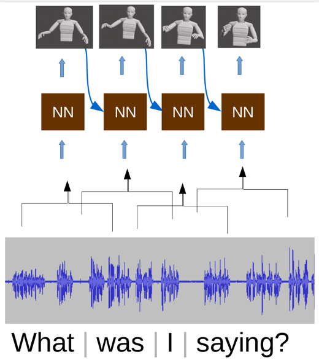

<p align="center">
  <b style="font-size: 42px;"> Gesticulator:</b>
  <b style="font-size: 42px;"> A framework for semantically-aware speech-driven gesture generation </b>
  <p style="font-size: 28px;" align="center"> <a href="https://svito-zar.github.io/">Taras Kucherenko</a>, <a href="http://www.patrikjonell.se">Patrik Jonell</a>, <a href="https://svanwaveren.wordpress.com">Sanne van Waveren</a>, <a href="https://people.kth.se/~ghe/">Gustav Eje Henter</a>, Simon Alexanderson, <a href="https://iolandaleite.com">Iolanda Leite</a>, <a href="http://www.csc.kth.se/~hedvig/">Hedvig Kjellström</a> </p>
  <p style="font-size: 24px;" align="center"> International Conference on Multimodal Interaction (ICMI '20) </p>
</p>

<p align="center">
 <a href="https://arxiv.org/abs/2001.09326" style="font-size: 30px; text-decoration: none">Paper   </a>  
 <a style="font-size: 35px; text-decoration: none"> |   </a> 
 <a href="https://github.com/Svito-zar/gesticulator" style="font-size: 30px; text-decoration: none">   Code</a>   
</p>


<div style="text-align:center"></div>

&nbsp;

### ABSTRACT
During speech, people spontaneously gesticulate, which plays a key role in conveying information. Similarly, realistic co-speech gestures are crucial to enable natural and smooth interactions with social agents. Current data-driven co-speech gesture generation systems use a single modality for representing speech: either audio or text. These systems are therefore confined to producing either acoustically-linked beat gestures or semantically-linked gesticulation (e.g., raising a hand when saying &ldquo;high&rdquo;): they cannot appropriately learn to generate both gesture types. We present a model designed to produce arbitrary beat and semantic gestures together. Our deep-learning based model takes both acoustic and semantic representations of speech as input, and generates gestures as a sequence of joint angle rotations as output. The resulting gestures can be applied to both virtual agents and humanoid robots. Subjective and objective evaluations confirm the success of our approach.

&nbsp;

***
&nbsp;

Main video explaining the paper:

<iframe width="660" height="415" src="https://www.youtube.com/embed/VQ8he6jjW08" frameborder="0" allow="accelerometer; autoplay; encrypted-media; gyroscope; picture-in-picture" allowfullscreen></iframe>


&nbsp;

***
&nbsp;


Citation format:
```
@inproceedings{kucherenko2020gesticulator,
  title={Gesticulator: A framework for semantically-aware speech-driven gesture generation},
  author={Kucherenko, Taras and Jonell, Patrik and van Waveren, Sanne and Henter, Gustav Eje and Alexanderson, Simon and Leite, Iolanda and Kjellstr{\"o}m, Hedvig},
  booktitle={Proceedings of the ACM International Conference on Multimodal Interaction},
  year={2020}
}
```


