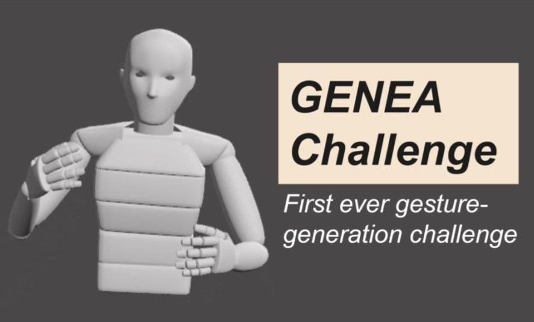

<p align="center">
  <b style="font-size: 48px;"> A large, crowdsourced evaluation of gesture generation systems on common data: The GENEA Challenge 2020 </b>
  <p style="font-size: 32px;"> <a href="https://svito-zar.github.io/">Taras Kucherenko</a>, <a href="http://www.patrikjonell.se">Patrik Jonell</a>,  <a href="https://sites.google.com/view/youngwoo-yoon/">Youngwoo Yoon</a>, <a href="https://www.pieterwolfert.com/"> Pieter Wolfert</a>,  <a href="https://people.kth.se/~ghe/"> Gustav Eje Henter</a> </p>
</p>

<p align="center">
 <a href="https://zenodo.org/record/4094697#.YP69xTqxU5k" style="font-size: 28px; text-decoration: none">[early workshop paper]  </a>  
 <a style="font-size: 35px; text-decoration: none"> |   </a> 
 <a href="https://dl.acm.org/doi/pdf/10.1145/3397481.3450692" style="font-size: 28px; text-decoration: none">[latest paper]   </a>   
</p>

<div style="text-align:center"></div>

&nbsp;

### ABSTRACT
Co-speech gestures, gestures that accompany speech, play an important role in human communication. Automatic co-speech gesture generation is thus a key enabling technology for embodied conversational agents (ECAs). The field of gesture generation is not moving forward as fast as it could, because there is no benchmarking culture in the field and those who do compare with the previous work usually do not do it consistently: everyone evaluates systems in their own way. Benchmarking has accelerated development in several other fields, such as speech synthesis and machine learning and should also speed up progress in gesture generation. We felt like somebody needed to do it. And hence we run the world’s first Gesture Generation Challenge! This work reports on the purpose, design, results, and implications of our challenge.


&nbsp;

***
&nbsp;

### Main video explaining the paper:

<iframe width="660" height="415" src="https://www.youtube.com/embed/QmaoKRzoVwM" frameborder="0" allow="accelerometer; autoplay; encrypted-media; gyroscope; picture-in-picture" allowfullscreen></iframe>

&nbsp;

***
&nbsp;

### Open-source materials:

<div style="text-align:left">

<br>
<p style="font-size: 18px;"> User-study video stimuli  <a href="https://zenodo.org/record/4080919"> DOI: 10.5281/zenodo.4080919 </a> </p> 
<p style="font-size: 18px;"> 3D coordinates of submitted motion <a href="https://zenodo.org/record/4088319"> DOI: 10.5281/zenodo.4088319 </a> </p> 
<p style="font-size: 18px;"> Submitted BVH files <a href="https://zenodo.org/record/4785119"> DOI: 10.5281/zenodo.4785119 </a> </p> 
<br>
<br>
</div>

<div style="text-align:left">

<br>
<p style="font-size: 18px;"> Code for visualising gesture motion  <a href="https://github.com/jonepatr/genea_visualizer"> GENEA visualizer </a> </p> 
<p style="font-size: 18px;"> Code for computing the numerical evaluation metrics <a href="https://github.com/genea-workshop/genea_numerical_evaluations"> GENEA numerical evaluations  </a> </p> 
<br>
<br>
</div>

<div style="text-align:left">

<br>
<p style="font-size: 18px;"> User-study subjective results and scripts to analyze them <a href="https://zenodo.org/record/4088250"> DOI: 10.5281/zenodo.4088250 </a> </p> 
<br>
<br>
</div>

&nbsp;

***
&nbsp;

### Citation format:
```
@inproceedings{kucherenko2020large,
author = {Kucherenko, Taras and Jonell, Patrik and Yoon, Youngwoo and Wolfert, Pieter and Henter, Gustav Eje},
title = {A Large, Crowdsourced Evaluation of Gesture Generation Systems on Common Data: The {GENEA} {C}hallenge 2020},
year = {2021},
isbn = {9781450380171},
publisher = {Association for Computing Machinery},
address = {New York, NY, USA},
url = {https://doi.org/10.1145/3397481.3450692},
doi = {10.1145/3397481.3450692},
booktitle = {26th International Conference on Intelligent User Interfaces},
pages = {11--21},
numpages = {11},
keywords = {evaluation paradigms, conversational agents, gesture generation},
location = {College Station, TX, USA},
series = {IUI '21}
}
```


