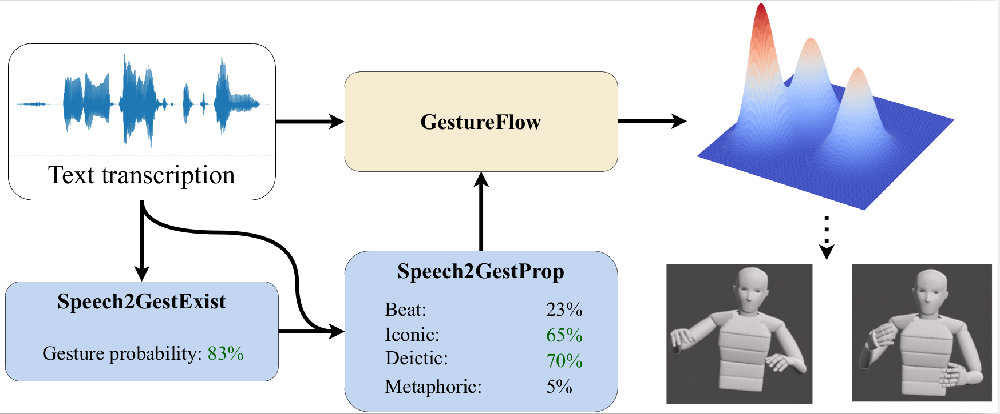

<p align="center">
  <b style="font-size: 42px;"> Speech2Properties2Gestures:</b>
  <b style="font-size: 42px;"> Gesture-Property Prediction as a Tool for Generating Representational Gestures from Speech </b>
  <p style="font-size: 28px;" align="center"> <a href="https://svito-zar.github.io/">Taras Kucherenko</a>, <a href="https://nagyrajmund.github.io/">Rajmund Nagy</a>, <a href="http://www.patrikjonell.se">Patrik Jonell</a>, <a href="https://www.cs.ucdavis.edu/~neff/">Michael Neff</a>, <a href="http://www.csc.kth.se/~hedvig/">Hedvig Kjellström</a>, <a href="https://people.kth.se/~ghe/">Gustav Eje Henter</a> </p>
  <p style="font-size: 24px;" align="center"> International Conference on Intelligent Virtual Agents  (IVA '21) </p>
</p>

<p align="center">
 <a href="https://arxiv.org/abs/2106.14736" style="font-size: 30px; text-decoration: none">[Project proposal]   </a>  
 <a href="https://arxiv.org/abs/2108.05762" style="font-size: 30px; text-decoration: none">[Speech2Prop feasibility analysis]   </a>  
</p>

&nbsp;


&nbsp;

***
&nbsp;

### ABSTRACT
We propose a new framework for gesture generation, aiming to allow data-driven approaches to produce more semantically rich gestures. Our approach first predicts whether to gesture, followed by a prediction of the gesture properties. Those properties are then used as conditioning for a modern probabilistic gesture-generation model capable of high-quality output. This empowers the approach to generate gestures that are both diverse and representational. 

<div style="text-align:center"></div>


&nbsp;

***
&nbsp;

### Citation format:
```
@inproceedings{kucherenko2021speech2properties2gestures,
      title={Speech2{P}roperties2{G}estures: {G}esture-Property Prediction as a Tool for Generating Representational Gestures from Speech}, 
      author={Kucherenko, Taras and Nagy, Rajmund and Jonell, Patrik and Neff, Michael and Kjellstr{\"o}m, Hedvig and Henter, Gustav Eje},
      year={2021},
      isbn = {9781450366724},
      publisher = {Association for Computing Machinery},
      address = {New York, NY, USA},
      url = {https://doi.org/10.1145/3472306.347833},
      doi = {10.1145/3472306.347833},
      booktitle = {Proceedings of the  21th ACM International Conference on Intelligent Virtual Agents},
      location = {Virtual Event, Japan},
      series = {IVA '21}
}
```
