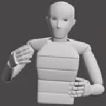

<p align="center">
  <b style="font-size: 45px;"> The GENEA Challenge 2023: <br/>A large-scale evaluation of gesture generation models in monadic and dyadic settings </b>
  <p style="font-size: 32px;"> <a href="https://svito-zar.github.io/">Taras Kucherenko</a>, <a href="https://nagyrajmund.github.io/">Rajmund Nagy</a>,  <a href="https://sites.google.com/view/youngwoo-yoon/">Youngwoo Yoon</a>, <a href="https://www.jieywoo.com/"> Jieyeon Woo</a>, Teodor Nikolov, Mihail Tsakov, <a href="https://people.kth.se/~ghe/"> Gustav Eje Henter</a> </p>
</p>

<div style="text-align:center"></div>

&nbsp;

### SUMMARY

<p>In the GENEA Challenge 2023 participating teams built speech-driven gesture-generation systems using the same speech and motion dataset, followed by a joint evaluation. This year’s challenge provided data on both sides of a dyadic interaction, allowing teams to generate full-body motion for an agent given its speech (text and audio) and the speech and motion of the interlocutor.12 submissions and 2 baselines were evaluated together with held-out motion-capture data in several large-scale user studies. The studies focused on three aspects: 1) the human-likeness of the motion, 2) the appropriateness of the motion for the agent’s own speech whilst controlling for the human-likeness of the motion, and 3) the appropriateness of the motion for the behaviour of the interlocutor in the interaction in segments where the interlocutor is speaking, using a setup that controls for both the human-likeness of the motion and the agent’s own speech. We found a large span in human-likeness between challenge submissions, with a few systems rated close to human mocap. Appropriateness seems far from being solved, with most submissions performing in a narrow range slightly above chance, far behind natural motion. The effect of the interlocutor is even more subtle, with submitted systems at best performing barely above chance. Interestingly, a dyadic system be- ing highly appropriate for agent speech does not necessarily imply high appropriateness for the interlocutor.</p>


<p>This page collects papers, videos, and other resources from our challenge. For more information about the design and results of the challenge, and what we learned from it, please see <a href="https://doi.org/10.1145/3397481.3450692">our main paper on the challenge, published at IUI 2021</a>.</p>


&nbsp;

***
&nbsp;


### Open-source materials:

<div style="text-align:left">

<br>
<p style="font-size: 18px;"> User-study video stimuli  <a href="https://zenodo.org/record/4080919"> DOI: 10.5281/zenodo.4080919 </a> </p> 
<p style="font-size: 18px;"> 3D coordinates of submitted motion <a href="https://zenodo.org/record/4088319"> DOI: 10.5281/zenodo.4088319 </a> </p> 
<p style="font-size: 18px;"> Submitted BVH files <a href="https://zenodo.org/record/4785119"> DOI: 10.5281/zenodo.4785119 </a> </p> 
<br>
<br>
</div>

<div style="text-align:left">

<br>
<p style="font-size: 18px;"> Code for visualising gesture motion  <a href="https://github.com/jonepatr/genea_visualizer"> GENEA visualizer </a> </p> 
<p style="font-size: 18px;"> Code for computing the numerical evaluation metrics <a href="https://github.com/genea-workshop/genea_numerical_evaluations"> GENEA numerical evaluations  </a> </p> 
<br>
<br>
<br>
</div>

<div style="text-align:left">

<br>
<p style="font-size: 18px;"> User-study subjective results and scripts to analyze them <a href="https://zenodo.org/record/4088250"> DOI: 10.5281/zenodo.4088250 </a> </p> 
<br>
<br>
<br>
<br>
<br>
</div>


&nbsp;

***
&nbsp;

### Citation format:
```
@inproceedings{kucherenko2023genea,
  author={Kucherenko, Taras and Nagy, Rajmund
     and Yoon, Youngwoo and Woo, Jieyeon
    and Nikolov, Teodor and Tsakov, Mihail
    and Henter, Gustav Eje},
  title={The {GENEA} {C}hallenge 2023: {A} large-scale
    evaluation of gesture generation models in
    monadic and dyadic settings},
  booktitle = {Proceedings of the ACM International
    Conference on Multimodal Interaction},
  publisher = {ACM},
  series = {ICMI '23},
  year={2023}
}
```


