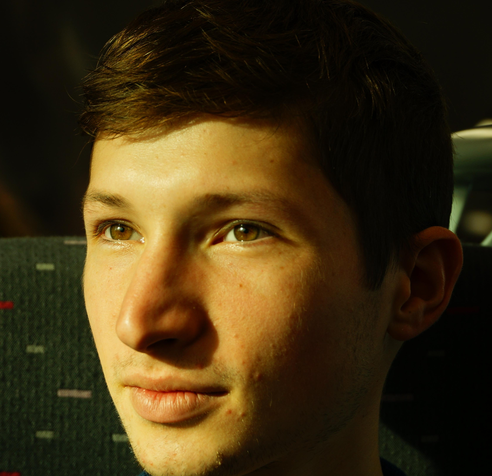

---
# Feel free to add content and custom Front Matter to this file.
# To modify the layout, see https://jekyllrb.com/docs/themes/#overriding-theme-defaults
layout: home
title: About
exclude: true
---

I am a Ph.D. student in Machine Learning for Social Robotics at KTH Royal Institute of Technology, Stockholm, Sweden.

My research is on generative models of non-verbal behavior, such as hand gestures and facial expressions.

I am working at the [EACare](http://www.csc.kth.se/cvap/EACare/) project, where we aim to develop a robot head with communicative skills capable of interacting with elderly people at their convenience.

 
### **News**

* May 2019: Presented our paper [On the importance of representations for speech-driven gesture generation](http://www.ifaamas.org/Proceedings/aamas2019/pdfs/p2072.pdf) at [AAMAS 2019](http://aamas2019.encs.concordia.ca/).
* April 2019: Our paper [Analyzing input and output representations for speech-driven gesture generation](https://www.researchgate.net/publication/331645229_Analyzing_Input_and_Output_Representations_for_Speech-Driven_Gesture_Generation) was accepter to [IVA 2019](https://iva2019.sciencesconf.org/) for oral presentation. (24% acceptance rate)
* Jan 2019: Our paper [On the importance of representations for speech-driven gesture generation](http://www.ifaamas.org/Proceedings/aamas2019/pdfs/p2072.pdf) was accepted at [AAMAS 2019](http://aamas2019.encs.concordia.ca/) for poster presentation.
* Oct 2018: My [project proposal](https://www.researchgate.net/publication/328032360_Data_Driven_Non-Verbal_Behavior_Generation_for_Humanoid_Robots) was published ICMI Doctoral Consortium 2018.
* April 2018 I become a member of a Social Robotics Sweden ([SoRoS](https://soros-community.github.io/)) community.
* June 2017: We had a [poster](https://www.csc.kth.se/~hedvig/publications/ssdl_17.pdf) at The First Swedish Symposium on Deep Learning (SSDL).
