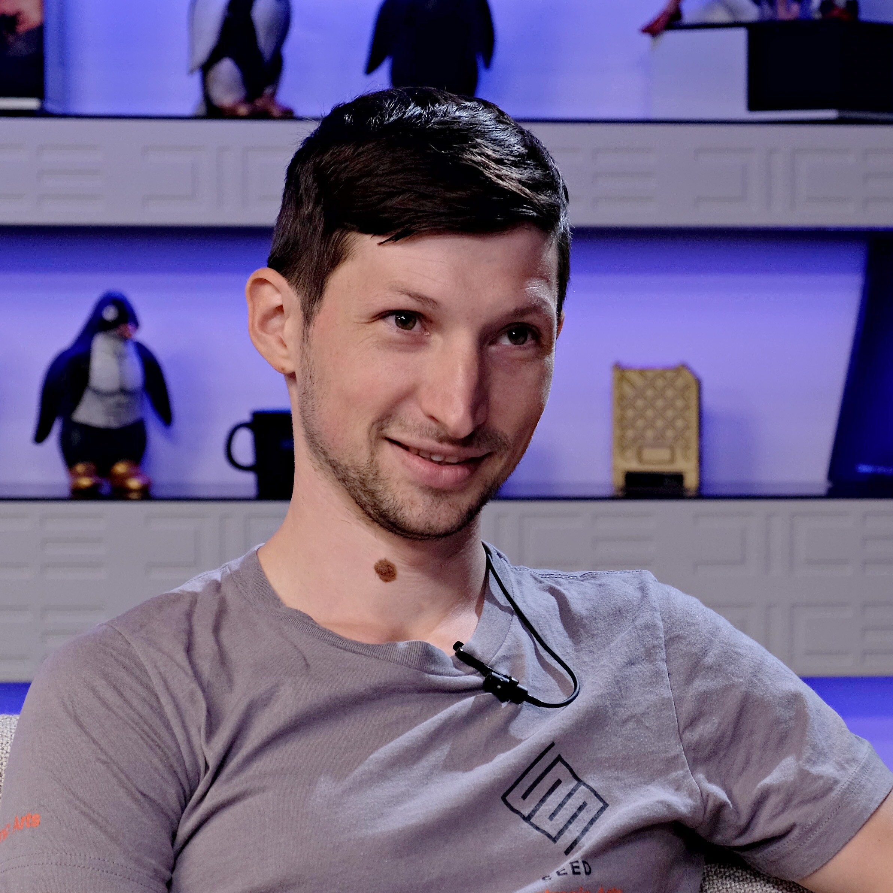

  

    
  

  

    

      I am a Research Scientist at Electronic Arts (EA). My research is on machine learning models for non-verbal behavior generation, such as hand gestures and facial expressions. One of my talks about it you can find <a href="https://youtu.be/JeMwtr8pxcc">in this video</a>. My favorite project, GENEA Challenge 2022, can be found on <a href="https://youngwoo-yoon.github.io/GENEAchallenge2022/">this project page</a>. My thesis is publicly available at <a href="https://www.diva-portal.org/smash/record.jsf?pid=diva2%3A1609615&dswid=9110">this url</a>.
    

    

      I come from Ukraine and my country has been invaded by Russia causing lots of suffering to the people. If you want to help - you can find many ways to do that in <a href="https://supportukrainenow.org/">this website</a>.
    

  

  <h2 class="section-title">Awards</h2>
  <ul class="awards-list">
    <li><strong>May 2023:</strong> <a href="https://cvpr2023.thecvf.com/">CVPR 2023</a> Outstanding Reviewer <a href="https://cvpr2023.thecvf.com/Conferences/2023/OutstandingReviewers">Award</a>!</li>
    <li><strong>Oct 2021:</strong> <a href="https://icmi.acm.org/2021/">ICMI 2021</a> Best Reviewer Award!</li>
    <li><strong>Sept 2021:</strong> Our paper <a href="https://dl.acm.org/doi/10.1145/3472306.3478333?cid=99659309831">Speech2Properties2Gestures</a> received Honourable Mention award at <a href="https://sites.google.com/view/iva2021/">IVA 2021</a>.</li>
    <li><strong>Oct 2020:</strong> <a href="https://svito-zar.github.io/gesticulator/">Gesticulator</a> got the ICMI 2020 Best Paper Award!</li>
    <li><strong>Oct 2020:</strong> <a href="https://jonepatr.github.io/lets_face_it/">Let's face it</a> received the IVA 2020 Best Paper Award!</li>
    <li><strong>May 2020:</strong> We received Honourable Mention award at Eurographics 2020 for our paper <a href="https://diglib.eg.org/handle/10.1111/cgf13946">Style-Controllable Speech-Driven Gesture Synthesis Using Normalising Flows</a>.</li>
  </ul>

  <h2 class="section-title">Recent News</h2>
  <ul>
    <li><strong>Oct 2025:</strong> We launch the <a href="https://genea-workshop.github.io/leaderboard/">GENEA Leaderboard</a>, the first online living benchmark for evaluating and comparing speech-driven gesture generation models</li>
    <li><strong>Aug 2025:</strong> My first paper about my work for EA, <a href="https://arxiv.org/abs/2410.14334">Evaluating the evaluators: Towards human-aligned metrics for missing markers reconstruction</a>, was accepted at the ACM International Conference on Multimedia 2025 (<a href="https://acmmm2025.org/">ACM MM'25</a>)</li>
    <li><strong>May 2024:</strong> Thrilled to announce the publication of <a href="https://dl.acm.org/doi/10.1145/3656374">our paper on the second GENEA Challenge</a> in ACM Transactions on Graphics (TOG)! Joint work with Pieter Wolfert, Youngwoo Yoon, Carla Viegas, Teodor Nikolov, Mihail Tsakov and Gustav Eje Henter</li>
    <li><strong>Feb 2023:</strong> Our paper <a href="https://arxiv.org/abs/2301.05339">A Comprehensive Review of Data-Driven Co-Speech Gesture Generation</a> was accepted at <a href="https://eg2023.saarland-informatics-campus.de/">EuroGraphics 2023</a>.</li>
    <li><strong>Feb 2023:</strong> <a href="https://genea-workshop.github.io/2023/challenge/">GENEA Challenge 2023</a> was accepted at <a href="https://icmi.acm.org/2023/">ICMI 2023</a> as a Multimodal Grand Challenge.</li>
    <li><strong>Nov 2022:</strong> Our paper <a href="https://dl.acm.org/doi/10.1145/3536221.3558058">The GENEA Challenge 2022: A large evaluation of data-driven co-speech gesture generation</a> was published at <a href="https://icmi.acm.org/2022/">ICMI 2022</a>.</li>
    <li><strong>Nov 2022:</strong> GENEA challenge and a workshop are presented at <a href="https://icmi.acm.org/2022/">ICMI 2022</a>. Here are their websites: the <a href="https://genea-workshop.github.io/2022/challenge/">GENEA Challenge 2022</a> and the <a href="https://genea-workshop.github.io/2022/workshop/">GENEA Workshop 2022</a>.</li>
    <li><strong>July 2022:</strong> Our paper <a href="https://dl.acm.org/doi/10.1145/3514197.3549697?cid=99659309831">Evaluating Data-Driven Co-Speech Gestures of Embodied Conversational Agents through Real-Time Interaction</a> was accepted at <a href="https://ivaconference2022.ualg.pt/">IVA 2022</a>.</li>
    <li><strong>May 2022:</strong> Our paper <a href="https://ifaamas.org/Proceedings/aamas2022/pdfs/p770.pdf">Multimodal analysis of the predictability of hand-gesture properties</a> was published at <a href="https://aamas2022-conference.auckland.ac.nz/">AAMAS 2022</a>.</li>
    <li><strong>Mar 2022:</strong> A challenge and a workshop accepted at <a href="https://icmi.acm.org/2022/">ICMI 2022</a>: the <a href="https://genea-workshop.github.io/2022/challenge/">GENEA Challenge 2022</a> and the <a href="https://genea-workshop.github.io/2022/workshop/">GENEA Workshop 2022</a>.</li>
    <li><strong>Feb 2022:</strong> I joined EA Games R&D department, called SEED, as research engineer.</li>
  </ul>

  
Older News (2017 &ndash; 2021)

  <ul>
    <li><strong>Dec 2021:</strong> Our paper <a href="https://arxiv.org/abs/2108.05762">Multimodal analysis of the predictability of hand-gesture properties</a> was accepted to <a href="https://aamas2022-conference.auckland.ac.nz/">AAMAS 2022</a>.</li>
    <li><strong>Dec 2021:</strong> I defended my thesis. My opponent was Stefan Kopp and you can find more info under <a href="https://svito-zar.github.io/defence/">this link</a></li>
    <li><strong>Nov 2021</strong> I gave two talks about my research on co-speech gesture synthesis: for <a href="https://sairlab.github.io/">SAIR Lab</a> at <a href="https://www.kcl.ac.uk/">King's College London</a> and for <a href="https://cambridge-afar.github.io/">Affective Intelligence and Robotics Laboratory</a> at <a href="https://www.cam.ac.uk/">Cambridge University</a></li>
    <li><strong>Oct 2021:</strong> Our GENEA Workshop 2021 is happening at ICMI 2021. <a href="https://genea-workshop.github.io/2021/">Workshop page</a></li>
    <li><strong>Sept 2021:</strong> Started an internship at Microsoft Research UK Applied Research team</li>
    <li><strong>July 2021:</strong> Two papers accepted at <a href="https://icmi.acm.org/2021/">ICMI 2021</a>: <a href="https://arxiv.org/abs/2101.11898">HEMVIP</a> and <a href="https://arxiv.org/abs/2108.05709">To Rate or Not To Rate</a>.</li>
    <li><strong>June 2021:</strong> Our paper <a href="https://dl.acm.org/doi/pdf/10.1145/3472306.3478333">Speech2Properties2Gestures</a> was accepted to <a href="https://sites.google.com/view/iva2021/">IVA 2021</a>.</li>
    <li><strong>Mar 2021:</strong> Our GENEA Workshop 2021 has been accepted at ICMI 2021. <a href="https://genea-workshop.github.io/2021/#call-for-papers">Call for papers</a> is out!</li>
    <li><strong>Feb 2021:</strong> Our demonstrator <a href="http://www.ifaamas.org/Proceedings/aamas2021/pdfs/p1779.pdf">A Framework for Integrating Gesture Generation Models into Interactive Conversational Agents</a> was accepted to AAMAS 2021.</li>
    <li><strong>Feb 2021:</strong> <a href="https://syncedreview.com/">Synced</a> wrote an <a href="https://syncedreview.com/2021/02/10/icmi-2020-best-paper-gesticulator-a-framework-for-semantically-aware-speech-driven-gesture-generation/">article</a> about <a href="https://svito-zar.github.io/gesticulator/">Gesticulator</a>.</li>
    <li><strong>Jan 2021:</strong> Our paper <a href="https://www.tandfonline.com/doi/full/10.1080/10447318.2021.1883883">Moving fast and slow</a> got accepted to the International Journal of Human-Computer Interaction.</li>
    <li><strong>Dec 2020:</strong> Our paper <a href="https://dl.acm.org/doi/10.1145/3397481.3450692">The GENEA Challenge 2020</a> was accepted to IUI 2021.</li>
    <li><strong>Oct 2020:</strong> I gave a <a href="https://talking-robotics.github.io/session_details/taras.html">talk</a> about gesture generation for the <a href="https://talking-robotics.github.io">Talking Robotics</a> seminar series.</li>
    <li><strong>Sept 2020:</strong> One more paper accepted to IVA 2020: <a href="https://arxiv.org/abs/2006.09888">Let's face it</a>.</li>
    <li><strong>Aug 2020:</strong> Our paper <a href="https://arxiv.org/abs/2001.09326">Gesticulator</a> got accepted to ICMI 2020!</li>
    <li><strong>July 2020:</strong> Two papers accepted for <a href="http://iva2020.psy.gla.ac.uk">IVA 2020</a>.</li>
    <li><strong>April 2020:</strong> CFP for our IVA'20 <a href="https://genea-workshop.github.io/2020/">Workshop</a> on Generation and Evaluation of Non-verbal Behaviour for Embodied Agents is <a href="https://easychair.org/cfp/GENEA_Workshop_2020">out</a>.</li>
    <li><strong>Feb 2020:</strong> Our paper <a href="https://diglib.eg.org/handle/10.1111/cgf13946">Style-Controllable Speech-Driven Gesture Synthesis Using Normalising Flows</a> was accepted to Eurographics 2020.</li>
    <li><strong>November 2019:</strong> <a href="https://youtu.be/AS5VorjTwcg">Talk</a> on general direction of my research.</li>
    <li><strong>September 2019</strong> Talk on <a href="https://ps.is.tuebingen.mpg.de/events/how-to-make-your-agent-gesture-in-a-natural-way">How to make your agent gesture in a natural way</a> at Max Planck Institute for Intelligent Systems.</li>
    <li><strong>August 2019:</strong> Our gesture generation model was applied to a new dataset. Check out a short <a href="https://youtu.be/tQLVyTVtsSU">demo video</a> and our <a href="https://github.com/Svito-zar/speech-driven-hand-gesture-generation-demo">code</a>.</li>
    <li><strong>June 2019:</strong> Two papers accepted for <a href="https://nicolas-navarro-guerrero.gitlab.io/workshop-non-verbal-human-robot-interactions-icdl-epirob-2019/">ICDL-EPIROB 2019 Workshop</a>.</li>
    <li><strong>April 2019:</strong> Our paper <a href="https://www.researchgate.net/publication/331645229_Analyzing_Input_and_Output_Representations_for_Speech-Driven_Gesture_Generation">Analyzing input and output representations for speech-driven gesture generation</a> was accepted to <a href="https://iva2019.sciencesconf.org/">IVA 2019</a>.</li>
    <li><strong>Jan 2019:</strong> Our paper <a href="http://www.ifaamas.org/Proceedings/aamas2019/pdfs/p2072.pdf">On the importance of representations for speech-driven gesture generation</a> was accepted at <a href="http://aamas2019.encs.concordia.ca/">AAMAS 2019</a>.</li>
    <li><strong>Oct 2018:</strong> My <a href="https://www.researchgate.net/publication/328032360_Data_Driven_Non-Verbal_Behavior_Generation_for_Humanoid_Robots">project proposal</a> was published at ICMI Doctoral Consortium 2018.</li>
    <li><strong>June 2017:</strong> We had a <a href="https://www.csc.kth.se/~hedvig/publications/ssdl_17.pdf">poster</a> at The First Swedish Symposium on Deep Learning.</li>
  </ul>

  <h2 class="section-title">Academic Service</h2>

  <h4>Co-organizing</h4>
  <ul>
    <li>ICMI'26 <a href="https://genea-workshop.github.io/2026/workshop">Workshop</a> on Generation and Evaluation of Non-verbal Behaviour for Embodied Agents</li>
    <li>ACM MM'25 <a href="https://genea-workshop.github.io/2025/workshop">Workshop</a> on Generation and Evaluation of Non-verbal Behaviour for Embodied Agents</li>
    <li>ICMI'24 <a href="https://genea-workshop.github.io/2024/workshop">Workshop</a> on Generation and Evaluation of Non-verbal Behaviour for Embodied Agents</li>
    <li>ICMI'23 <a href="https://genea-workshop.github.io/2023/workshop">Workshop</a> on Generation and Evaluation of Non-verbal Behaviour for Embodied Agents</li>
    <li>ICMI'22 <a href="https://genea-workshop.github.io/2022/workshop">Workshop</a> on Generation and Evaluation of Non-verbal Behaviour for Embodied Agents</li>
    <li>ICMI'21 <a href="https://genea-workshop.github.io/2021/">Workshop</a> on Generation and Evaluation of Non-verbal Behaviour for Embodied Agents</li>
    <li>IVA'20 <a href="https://genea-workshop.github.io/2020/">Workshop</a> on Generation and Evaluation of Non-verbal Behaviour for Embodied Agents</li>
    <li><a href="http://sprakbanken.speech.kth.se/events/gespin/">GESPIN 2020 Conference</a></li>
    <li><a href="https://soros-community.github.io/">SoRoS</a> 2020 Workshop</li>
    <li>NIPS 2018 <a href="https://aiforsocialgood.github.io/2018/cfp.htm">Workshop on AI for Social Good</a></li>
  </ul>

  <h4>Reviewer</h4>
  <ul>
    <li><strong>2023:</strong> FG, IEEE VR, EuroGraphics, CVPR, SIGGRAPH, ACII, IVA, SIGGRAPH Asia</li>
    <li><strong>2022:</strong> HRI, CHI, CVPR, AISTATS, IVA, ICMI, SIGGRAPH Asia</li>
    <li><strong>2021:</strong> ACII, ICMI, ROMAN, ICCV Workshops</li>
    <li><strong>2020:</strong> ECAI, IJCAI, SIGGRAPH, IVA, ICMI LBR</li>
    <li><strong>2019:</strong> ACII, ICSR</li>
    <li><strong>2018:</strong> NIPS Workshop on AI for Social Good</li>
  </ul>

