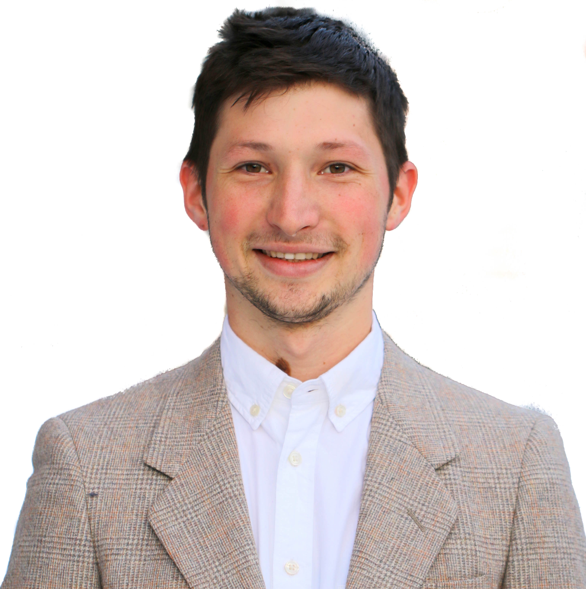

---
# Feel free to add content and custom Front Matter to this file.
# To modify the layout, see https://jekyllrb.com/docs/themes/#overriding-theme-defaults
layout: home
title: 
exclude: true
---

I am a Ph.D. student in Machine Learning for Social Robotics at KTH Royal Institute of Technology, Stockholm, Sweden.

My research is on generative models of non-verbal behavior, such as hand gestures and facial expressions.

I am working in the [EACare](http://www.csc.kth.se/cvap/EACare/) project, where we aim to develop a robot system to detect early signs of Dementia from the communicative behavior.

 
### **News**

* <strong>August 2019:</strong> 
I am looking for a research engineer for a short project. Contact me if you are interested

* <strong>August 2019:</strong> 
We have applied our gesture generation model to a new dataset, which is in English. Check our a short
 [demo video](https://youtu.be/tQLVyTVtsSU) 
and our
 [code](https://github.com/Svito-zar/speech-driven-hand-gesture-generation-demo) 
with a pre-trained model

* <strong>June 2019:</strong> 
Our two papers were accepted for
 [ICDL-EPIROB 2019 Workshop](https://nicolas-navarro-guerrero.gitlab.io/workshop-non-verbal-human-robot-interactions-icdl-epirob-2019/) 
on Naturalistic Non-Verbal and Affective Human-Robot Interactions

* <strong>May 2019:</strong> 
Gave a talk on my research at the
 [Pint Of Science](http://pintofscience.se/) 
in Stockholm

* <strong>April 2019:</strong> 
Our paper
 [Analyzing input and output representations for speech-driven gesture generation](https://www.researchgate.net/publication/331645229_Analyzing_Input_and_Output_Representations_for_Speech-Driven_Gesture_Generation) 
was accepter to
 [IVA 2019](https://iva2019.sciencesconf.org/) 
for oral presentation. (24% acceptance rate)

* <strong>Jan 2019:</strong> 
Our paper
 [On the importance of representations for speech-driven gesture generation](http://www.ifaamas.org/Proceedings/aamas2019/pdfs/p2072.pdf) 
was accepted at
 [AAMAS 2019](http://aamas2019.encs.concordia.ca/) 
for poster presentation.

* <strong>Oct 2018:</strong> 
My
 [project proposal](https://www.researchgate.net/publication/328032360_Data_Driven_Non-Verbal_Behavior_Generation_for_Humanoid_Robots) 
was published ICMI Doctoral Consortium 2018.

* <strong>April 2018:</strong> 
I become a member of a Social Robotics Sweden (
[SoRoS](https://soros-community.github.io/)
) community.

* <strong>June 2017:</strong> 
We had a
 [poster](https://www.csc.kth.se/~hedvig/publications/ssdl_17.pdf) 
at The First Swedish Symposium on Deep Learning (SSDL).

