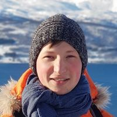

---
# Feel free to add content and custom Front Matter to this file.
# To modify the layout, see https://jekyllrb.com/docs/themes/#overriding-theme-defaults
layout: home
title: About
exclude: true
---
<!--  -->

My name is **Taras Kucherenko** and I am a Ph.D. student in Machine Learning for Social Robotics at KTH Royal Institute of Technology, Stockholm, Sweden.
My research is on generative models of non-verbal behavior, such as hand gestures and facial expressions.
